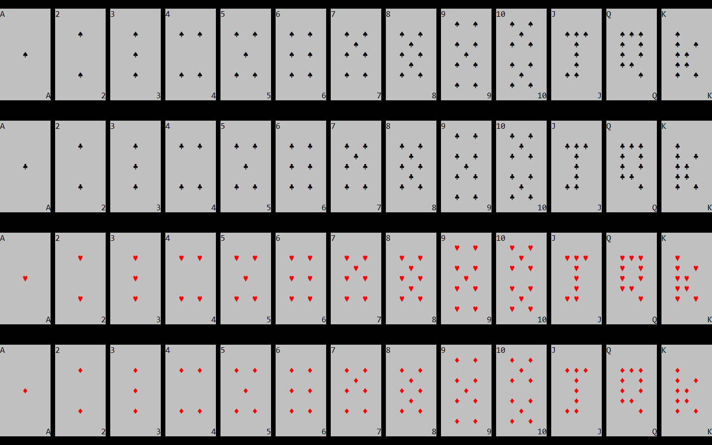

# PlayingCards
Python 2.7 package for simulating cards games and shuffles in terminal! Written during Isolation 2020.


### How to setup:
1) "git clone https://github.com/Shellywell123/PlayingCards.git"

### How to update:

1) 
```bash
cd PlayingCards/
```
2)
```bash
git pull
```

### How to run:
1) execute play.py
   ```python
   python play.py
   ```

### Features:
- Windows cmd & Linux terminal compatiable<!--- (for correct ascii in Windows 'chcp 65001' may be required) --->
- card ascii art

- simulated real shuffles
- random computer shuffles
- blackjack game play
- game play stats
- accounts and leaderboard

### current bugs:
- help option needs to re ask()

### Coming Soon:
- five card trick
- number of times an account has gone broke counter
- docstrings
- dealer blackjack insurance
- chips breakdown
- will make things classy
- will make python 3 if cba
- password logins
- split (rebet + split screen)
- sounds
- stats of hands won and number of loans
- multiple decks
- up down menu style interaction
- muliple hands side by side view (poker)