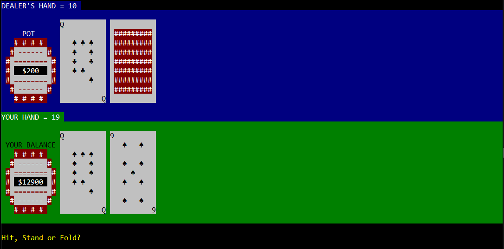

# PlayingCards
Python package for simulating cards games and shuffles in terminal! Written during Isolation 2020.

### How to setup:
1) git clone https://github.com/Shellywell123/PlayingCards.git

### How to run:
1) execute play.py

### Features:
-windows cmd & linux terminal compatiable\
 (for correct ascii in windows 'chcp 65001' may be required)\
-card asci art\
-simulated real shuffles\
-random computer shuffles\
-blackjack game play\
-game play stats\
-accounts and leaderboard

### Coming Soon:

-windows cmd compatibility\
-docstrings\
-dealer blackjack insurance\
-chips breakdown\
-fold option\
-texas holdem\
-will make things classy\
-will make python 3 if cba\
-automated plays\
-password logins\
-split\
-sounds\
-all in\
-stats of hands won and number of loans\
-dealer hit more than once\